# 🚂 YatraGuard — Autonomous Regional Rail Co-Pilot for Indian Elders

> **"We recently watched our elderly neighbor, Sharma Uncle, prepare for an overnight train journey alone. He was visibly anxious, clutching a paper notebook with helpline numbers, and asking anyone nearby how he would know when his station arrived in the middle of the night. His children were constantly calling him, draining his phone battery just to verify his location. Watching this friction, we asked ourselves: Why should travel be terrifying for India's elders when modern orchestration can act as their digital guardian? That morning, YatraGuard was born."**

YatraGuard is a **stateful, long-running Kestra orchestration** that turns a simple WhatsApp message into an autonomous 24-hour travel shield for Indian elders. By replacing high-friction, complicated apps with a **zero-install, multi-lingual WhatsApp thread**, YatraGuard bridges the digital divide, giving elderly passengers absolute autonomy and their families total peace of mind.

---

## 🛑 The Problem: The High-Friction Travel Crisis
For millions of senior citizens in India, traveling alone on the massive Indian Railways network is an exhausting, anxiety-inducing experience:
1. **App Fatigue:** Modern tracking apps are filled with spam ads, require constant internet connectivity, and have complex user interfaces that overwhelm senior citizens.
2. **The Sleeping Hazard:** Trains frequently run hours late, arriving at destinations in the dead of night. Elders are terrified of oversleeping and missing their stops, leading to sleepless, stressful journeys.
3. **Communication Blindspots:** Anxious family members constantly call to check on live locations, draining the passenger's phone battery and creating panic if a call goes unanswered.

### 🛡️ The Solution: YatraGuard Impact
YatraGuard acts as an **invisible digital guardian**. The moment an elder texts their train number on WhatsApp, Kestra spins up a stateful monitoring mesh that tracks their journey in real-time, communicates with them entirely in their native language (**English, Hindi, or Marathi**), and coordinates parallel emergency, safety, and pickup alerts.

---

## 🧠 System Architecture & Workflow

YatraGuard is powered by **Kestra's event-driven workflow engine**, coordinating a PostgreSQL state ledger, Groq LLM parsing, Twilio WhatsApp APIs, and a custom automated localized video pipeline. 

Here is the high-fidelity, non-overlapping architectural layout of the stateful monitoring engine:



### 🗺️ The Step-by-Step Orchestration Path:
1. **Passenger Ingestion:** The elderly passenger texts their train number (e.g., `12903`) to the Twilio WhatsApp Number.
2. **Secure Webhook Tunnel:** Twilio forwards the message via ngrok HTTP tunnel to Kestra Ingest.
3. **Groq AI Natural Language Engine:** Groq LLM parses the message in real-time, extracting the train number, destination station, and language preference (English, Hindi, or Marathi).
4. **PostgreSQL Active State Ledger:** Kestra registers the journey as `ACTIVE` inside the database.
5. **Stateful Monitoring Loop:** Flow 2 wakes up every 30 minutes, querying the PostgreSQL ledger for active trips.
6. **IRCTC Live Telemetry:** Kestra polls the RapidAPI endpoint to fetch the train's precise location, upcoming station, and delays.
7. **Proximity Wakeup Gate:** When the train enters a **30km radius** from the target station, Kestra instantly fires:
   * **Wakeup Alert (to Passenger):** A localized native-language alert telling them their station is approaching.
   * **Pickup Alert (to Coordinator):** An alert in English sent directly to their family coordinator, telling them the exact arrival time and to leave for the station now.
8. **Interactive Option 5 Guide:** Passenger can reply **`5`** at any point to receive a high-speed video safety guide in their native language, compiled dynamically by our video pipeline.

---

## 🏆 Key Features & Technical Innovation

### 1. 🎞️ Fully Automated Localized Video Asset Pipeline (`build_assets.py`)
To ensure elders understand how to stay safe, YatraGuard features an **automated video generation pipeline**. Powered by `gTTS`, `moviepy`, and `pillow`, the script programmatically compiles high-resolution, localized travel safety videos with dynamic voiceovers, text overlays, and assets in **English, Hindi, and Marathi**. These assets are hosted on direct high-speed CDNs for instant, zero-buffer playback inside WhatsApp!

### 2. 🎧 AI Storyteller (Regional Station Folklore)
Long train journeys can be incredibly boring. Replying **`9`** triggers our **AI Storyteller**. Kestra queries the passenger's current or upcoming station from PostgreSQL and prompts Groq to generate a beautiful, 2-sentence cultural myth, historical story, or local culinary fact about that specific station, keeping the elder engaged and connected to the rich heritage of their route.

### 3. 🚨 Proximity-Triggered Parallel Dispatch
When the live IRCTC telemetry indicates the train is entering a **30km radius** from the destination, Kestra instantly breaks the regular status loop and triggers a **dual-alarm dispatch**:
*   **The Passenger Alert:** Sends a native-language emergency wakeup alert advising the passenger to gather their luggage and stay calm.
*   **The Coordinator Alert:** Sends a pickup alert to the family member (always in English) showing the train's precise delay, telling them to leave for the railway station immediately.

---

## 📂 Repository Structure

```text
rail-copilot-kestra/
├── docker-compose.example.yml   # Template local dev stack (Kestra + Postgres)
├── build_assets.py              # Automated localized MP4 video generator pipeline
├── .gitignore                   # Keeps production environment & API keys strictly local
├── README.md                    # Product & Technical Master Documentation
├── presentation_script.md       # Interactive live demo & presentation script
└── workflows/                   # Sanitized, git-tracked Kestra Workflows
    ├── yatraguard-ingest.yml    # Flow 1: Ingestion, NLP parsing & interactive command router
    ├── yatraguard-monitor.yml   # Flow 2: Live IRCTC polling, proximity gate, & alert mesh
    └── yatraguard-cleanup.yml   # Flow 3: Daily statistics, stale journey purges & logs
```

---

## 🛠️ Step-by-Step Installation & Setup

### Step 1 — Clone and Configure Environment
1. Copy `docker-compose.example.yml` in the root directory to a new file named `docker-compose.yml`:
   ```bash
   cp docker-compose.example.yml docker-compose.yml
   ```
2. Open `docker-compose.yml` and plug in your operational secrets in the Kestra environment block:
   ```yaml
   SECRET_TWILIO_ACCOUNT_SID:   "your_twilio_account_sid"
   SECRET_TWILIO_AUTH_TOKEN:    "your_twilio_auth_token"
   SECRET_TWILIO_WHATSAPP_FROM: "whatsapp:+14155238886" # Twilio Sandbox Number
   SECRET_RAPIDAPI_KEY:         "your_rapidapi_key"         # For IRCTC live updates
   SECRET_FAMILY_PHONE:         "91XXXXXXXXXX"               # Pickup Coordinator
   ```

### Step 2 — Start the Infrastructure Stack
Spin up the local Docker network (runs Kestra and PostgreSQL concurrently):
```powershell
docker compose up -d
```
Verify the stack is operational by opening the Kestra GUI at [http://localhost:8080](http://localhost:8080).

### Step 3 — Expose Your Local Gateway to Twilio
Twilio needs a public gateway to forward incoming WhatsApp messages to Kestra. Use `ngrok` to tunnel port 8080:
```powershell
ngrok http 8080
```
Copy the generated public URL (e.g. `https://xxxx-xxxx.ngrok-free.app`).

### Step 4 — Configure Webhook on Twilio Console
1. Go to your **Twilio Console** → **Messaging** → **Send a WhatsApp Message** (Sandbox).
2. Under **Sandbox Settings**, paste the following URL into the **"When a message comes in"** box (ensure method is set to **POST**):
   ```text
   https://<your_ngrok_domain>/api/v1/executions/webhook/yatraguard/yatraguard-ingest/yatraguard-whatsapp-gateway
   ```

### Step 5 — Import and Deploy Kestra Flows
1. In the Kestra GUI, navigate to **Flows** → **Create**.
2. Create three flows and paste the sanitized workflows located inside the `workflows/` directory:
   *   `workflows/yatraguard-ingest.yml` (Flow 1)
   *   `workflows/yatraguard-monitor.yml` (Flow 2)
   *   `workflows/yatraguard-cleanup.yml` (Flow 3)
3. Click **Save** on all three flows.

---

## 📱 Interactive Command Reference

Once registered, passengers can control their digital co-pilot simply by typing options **`0` through `9`** in their WhatsApp thread:

| Command | Action | Hindi Translation Output | Marathi Translation Output |
|:---:|---|---|---|
| **`1`** | **📍 Live Train Status** | लाइव स्थिति + AI यात्रा सलाह | लाइव्ह स्थिती + AI प्रवास सल्ला |
| **`2`** | **🛑 Stop Tracking** | ट्रैकिंग बंद कर दी गई है | ट्रॅकिंग थांबवले आहे |
| **`3`** | **🚨 Emergency Alert** | परिवार को अलर्ट भेजा गया है | कुटुंबाला आणीबाणी सूचना पाठवली |
| **`4`** | **📞 Railway Helpline** | 139 हेल्पलाइन कार्ड | 139 हेल्पलाईन कार्ड |
| **`5`** | **ℹ️ Safety Video Guide** | स्थानिक रेल्वे मार्गदर्शक व्हिडिओ | स्थानिक रेल्वे मार्गदर्शक व्हिडिओ |
| **`6`** | **💬 Call Request** | परिवार को कॉल करने का संदेश | कुटुंबाला कॉल करण्याचा निरोप |
| **`7`** | **👮 Railway Police (RPF)** | आरपीएफ सुरक्षा सहायता डायल | आरपीएफ सुरक्षा मदत डायल |
| **`8`** | **🍔 Order Seat Food** | IRCTC ई-केटरिंग मेनूकार्ड | IRCTC ई-कॅटरिंग मेनूकार्ड |
| **`9`** | **🎧 AI Storyteller** | स्टेशन का इतिहास व संस्कृति | स्टेशनचा इतिहास व संस्कृती |
| **`0`** | **🎲 Travel Games/Trivia** | खेल, पहेलियां और रेलवे सामान्य ज्ञान | खेळ, कोडी आणि रेल्वे सामान्य ज्ञान |

---

## ⚡ The Kestra Showpiece: Why This Wins Hackathons

YatraGuard is a masterclass in **Kestra's advanced capabilities**, proving it is the ultimate orchestrator for complex, event-driven consumer tech:

*   **Long-Running Stateful Orchestration:** Leverages Kestra's ability to maintain active state over a 24-hour period, waking up every 30 minutes to dynamically mutate the state of journeys from `ACTIVE` to `ARRIVING` to `COMPLETED`.
*   **Webhook Gateway Ingestion:** Processes highly asynchronous, URL-encoded incoming webhook payloads directly from Twilio, parsing complex forms dynamically inside Python script containers.
*   **PostgreSQL Native Integrations:** Seamlessly updates and queries persistent relational databases in milliseconds to control flow gates.
*   **Language-Agnostic Python Tasks:** Runs robust script boxes to execute Groq LLM API integrations and dynamic localized text fallbacks.
*   **Pebble Templating Prowess:** Demonstrates complex condition trees, timezone localizations, and JSON filters directly inside the YAML layer.

---

*Built with ❤️ to give Indian families peace of mind and keep our parents safe on the rails.*
